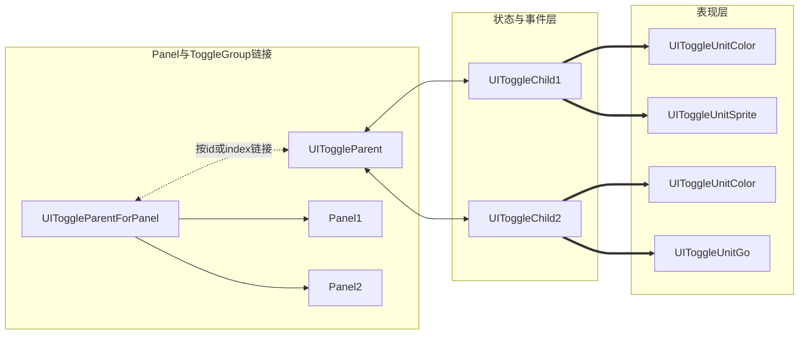

# ToggleGroup结构与梳理

```mermaid
flowchart LR
    Parent["UIToggleParent"]
    Child1["UIToggleChild1"]
    Child2["UIToggleChild2"]
    Unit_1_1["UIToggleUnitColor"]
    Unit_1_2["UIToggleUnitSprite"]
    Unit_2_1["UIToggleUnitColor"]
    Unit_2_2["UIToggleUnitGo"]

    ParentPanel["UIToggleParentForPanel"]
    Panel1["Panel1"]
    Panel2["Panel2"]
    
    Parent <--> Child1
    Parent <--> Child2
    Child1 ==> Unit_1_1
    Child1 ==> Unit_1_2
    Child2 ==> Unit_2_1
    Child2 ==> Unit_2_2
    
    subgraph 状态与事件层
        Child1
        Child2
    end
    
    subgraph 表现层
        Unit_1_1
        Unit_1_2
        Unit_2_1
        Unit_2_2
    end

    subgraph Panel与ToggleGroup链接
        ParentPanel <-.按id或index链接.->Parent
        ParentPanel --> Panel1
        ParentPanel --> Panel2
    end
```

可能后续将采用接口形式，处理更多类型的Toggle，比如能够实现Toggle时的动画实现？