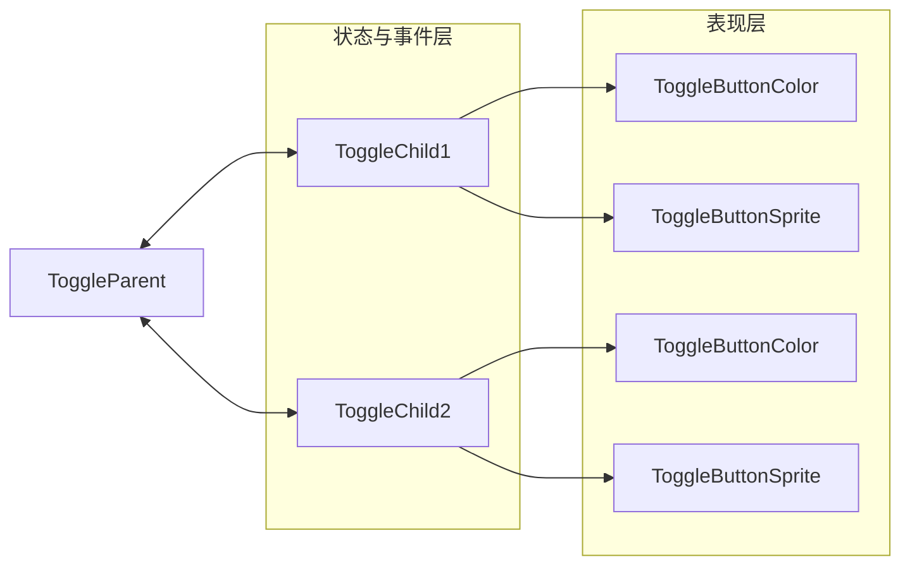

# ToggleGroup结构与梳理

```mermaid
flowchart LR
    Parent["ToggleParent"]
    Child1["ToggleChild1"]
    Child2["ToggleChild2"]
    Unit_1_1["ToggleButtonColor"]
    Unit_1_2["ToggleButtonSprite"]
    Unit_2_1["ToggleButtonColor"]
    Unit_2_2["ToggleButtonSprite"]
    
    
    Parent <--> Child1
    Parent <--> Child2
    Child1 --> Unit_1_1
    Child1 --> Unit_1_2
    Child2 --> Unit_2_1
    Child2 --> Unit_2_2
    
    subgraph 状态与事件层
        Child1
        Child2
    end
    
    subgraph 表现层
        Unit_1_1
        Unit_1_2
        Unit_2_1
        Unit_2_2
    end
```

可能后续将采用接口形式，处理更多类型的Toggle，比如能够实现Toggle时的动画实现？