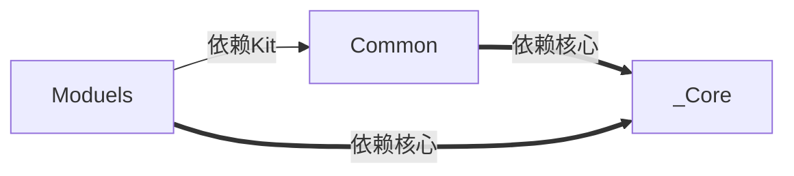

# AxuFrameKit依赖顺序
1. 核心模块(Core)：包含框架的基础功能和核心逻辑，其他模块都依赖于它，C#构成，无引擎依赖。
2. 公共模块(Common)：提供通用功能和工具类，依赖Unity环境，依赖于核心模块。
3. 其他模块(Modules)：实现具体功能，依赖Unity环境，核心模块和公共模块。

```mermaid
graph LR
    A[_Core]
    B[Common]
    C[Moduels]
    
    B ==依赖核心==> A
    C ==依赖核心==> A
    C --依赖Kit--> B
```